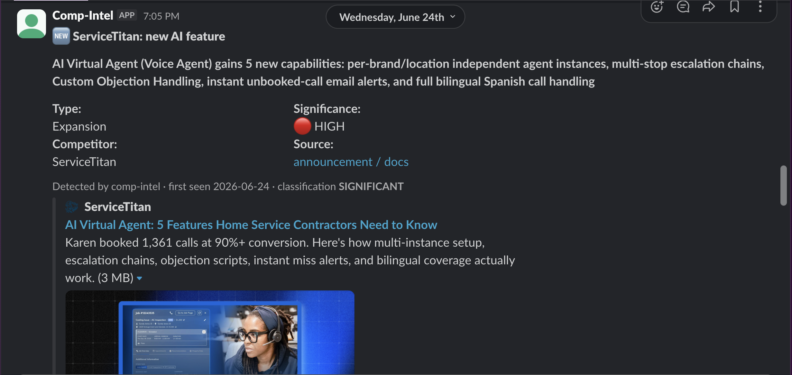
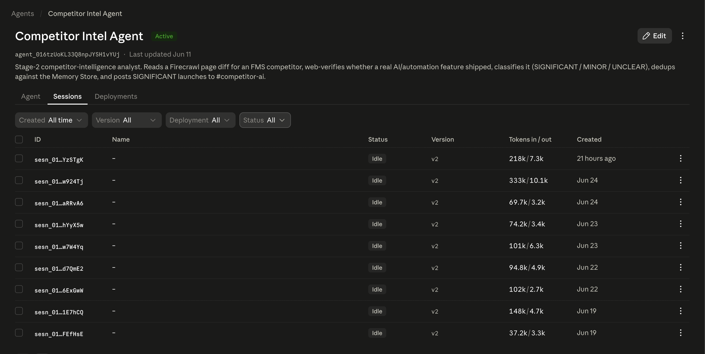
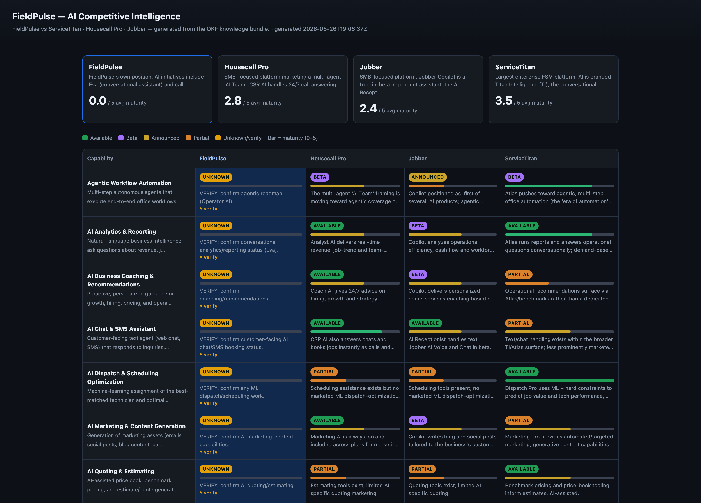

# Competitor Intel — AI Tracking & Comparison Dashboard

**FieldPulse Product Brief (PRD) · Draft for stakeholder review**

## 1. 🔴 Problem Statement

**FieldPulse has no fast, citable way to know what AI its top competitors have shipped.** We compete with FMS platforms — ServiceTitan, Housecall Pro, Jobber — that are shipping AI features fast and marketing them loudly. Product, Sales, and leadership need to know that landscape and speak to it confidently. Today that knowledge is ad hoc, manual, and doesn't scale:

- **No living, citable picture of competitors' AI.** What we "know" lives in people's heads and scattered Slack threads, and it goes stale the moment a competitor ships something new.
- **Research is manual and reactive.** Checking competitor sites, changelogs, and pricing pages by hand is slow, inconsistent, and unowned — so launches get missed or learned about weeks late.
- **Sales and leadership can't answer confidently.** There's no single source for "what AI does ServiceTitan actually have, how mature is it, and how do we compare?" — so battlecards and roadmap calls run on guesswork.
- **A prior attempt over-reached and stalled.** An earlier 75-competitor app tried to do everything at once (RSS feeds, per-site monitoring config, RBAC, snapshots, compare tables) and collapsed under its own weight.

**Impact of not addressing it:** slow, late, low-confidence competitive responses; a knowledge base that decays as fast as competitors move; and no defensible, evidence-based input to FieldPulse's own AI roadmap.

## 2. 🛠️ Existing Solution / Workarounds

**a) The live detector — `comp_intel_monitor` (running unattended ~2 weeks).** Firecrawl `/monitor` watches each competitor's changelog, pricing, and AI/feature pages daily; on a meaningful change, a Claude Managed Agent web-verifies the launch is real and new, classifies its significance, dedups it against a Memory Store, writes a short brief, and posts it to the `#competitor-ai` Slack channel. It has run hands-off for ~2 weeks (16 sessions over ~15 days) and has begun **recording real, web-verified competitor AI features** in its Memory Store and posting the significant ones to `#competitor-ai`. A recent example: the June 24 alert that ServiceTitan's **AI Virtual Agent (Voice Agent)** expanded with five new capabilities (multi-instance agents, escalation chains, custom objection handling, instant miss alerts, and bilingual Spanish) — classified SIGNIFICANT and sourced to ServiceTitan's own post. Other recorded entries include Jobber's **AI Voice**, **Auto-drafted quotes**, and **Marketing Suite AI**. (ServiceTitan **Atlas** was the real-content test that proved the pipeline end-to-end.) It correctly stays quiet on re-announcements.

**b) The knowledge base + dashboard — the OKF bundle (seeded, new).** The detector's findings plus deep research live as an **Open Knowledge Format** bundle (plain-markdown source of truth in git) that renders a competitor-by-capability comparison **dashboard** across a fixed 12-capability AI taxonomy, with FieldPulse itself as the fourth column for honest gap analysis.

**c) Manual / ad-hoc research.** One-off decks and Slack threads. Not maintained, not comparable across competitors, not cited — useful once, stale immediately.

**d) The proven precedent.** FieldPulse already runs focused AI agents in production (the Support email agent; this `comp_intel_monitor` detector). Competitor Intel reuses that pattern — a focused agent plus a maintained knowledge artifact.

**What's working today:**
- The detector reliably **catches and verifies** real competitor AI launches and posts them to Slack.
- The OKF bundle is seeded and the dashboard renders from it.

**What isn't:**
- The dashboard is **hard to read** — the 6/24 review flagged competing colors, an ambiguous maturity bar, and truncated cell text.
- The knowledge base is **shallow** (seed data, not yet deep-researched) and **not yet auto-updated** by the detector — the two systems run side by side instead of feeding each other.

**The takeaway:** we already have a working detector and a seeded, citable knowledge base. V2 makes the knowledge **readable** (dashboard redesign) and **connects the detector** so the picture stays current automatically.

## 3. 💡 Proposed Solution

**Make Competitor Intel a readable, citable, continuously-updated picture of competitors' AI** — by redesigning the dashboard for clarity and wiring the live detector to keep the knowledge base current. Start small: one comparison surface, three views, and one automated update path — all built on what already runs in production.

**🎯 Objective**

Let FieldPulse speak confidently about the competitive AI landscape and make evidence-based AI-roadmap decisions — backed by a single, cited source of truth that updates itself, instead of stale, hand-maintained notes.

v1 delivers three things on top of the existing detector and seeded bundle:

- **Dashboard redesign (readable comparison).** A visual-first matrix (status is the *only* color; maturity is a neutral glyph + number; no in-cell text), a click-through drawer that compares all four players for a capability, a per-competitor drill-in ("click into Housecall Pro"), and digestible AI summaries. The redesign is mostly *subtractive* — it removes the clutter the review flagged.
- **Trigger → knowledge base (auto-update).** The detector tags each verified launch with one of the 12 capabilities and updates the matching cell as a reviewable pull request — so a Slack alert also becomes a durable, cited entry in the dashboard.
- **The data to support it.** A `summary` per competitor and per capability, plus a `primary_source` ("learn more") link per cell — stored *in the bundle* (cited, maintained), not hardcoded in the UI.

**Generate-and-review posture.** The OKF bundle is the single source of truth; the dashboard is *generated* from it (never hand-maintained twice). Agent-written updates **will land as PRs a human approves** — review is the safety gate. FieldPulse's own rows stay flagged for verification (today mostly `unknown`) until confirmed internally (Eva / Emerging Technology); we never publish an inflated self-assessment.

**Beyond v1 (where this goes next).** v1 is deliberately the foundation — a clear comparison surface plus an automated update path. The natural next stages:
- **Stage 2 — deeper signal.** Social signals (Reddit, LinkedIn), screenshots, and broader sourcing added as additional cited references.
- **Stage 3 — operations UI.** A thin admin surface to schedule runs, review flagged cells, and approve updates — only once the cadence is proven.
- **Stage 4 — expansion.** Beyond the three pilot competitors, as the pattern holds.

## 8. 🔍 Open Questions

**Dashboard**
- Approve the status **color palette** — a colorblind-safe set that replaces today's competing colors. → **Evan / Marie**
- Are the per-competitor / per-capability **summaries** "research output" (authored in the deep-research seed pass) or their own task? → **Hamza / Evan**

**Knowledge base / the merge**
- The **write path** for auto-updates: the agent opens a PR vs. the receiver commits directly vs. a nightly sync. → **Hamza / Engineering**
- **Capability-tagging** edge cases (e.g., Jobber "AI Voice" = in-app copilot vs. inbound voice agent) — pin the definitions so the agent disambiguates. → **Hamza**

**Scope & cadence**
- Confirm the **3 pilot competitors** (ServiceTitan, Housecall Pro, Jobber) for v1, and when we expand. → **Evan**
- The **refresh cadence** for deep research (weekly change-detection, a monthly full pass, a quarterly deep review). → **Evan / Hamza**

**FieldPulse column**
- Who confirms FieldPulse's own AI rows out of `unknown` (the internal-truth source)? → **Eva / Emerging Technology**

**Resolved by the 6/24 review (previously open):** "What are the maturity bars for?" — they were doing two jobs (color + length) and confusing readers. v2 makes maturity a single neutral glyph + number, and moves cross-competitor comparison into the drawer.

## 9. 💡 Other Considerations

- **Most of v1 is reuse, not new build.** The detector, the Managed Agent, the Slack posting, the OKF bundle, the dashboard scaffold, and the conformance validator already exist. The net-new work is the dashboard redesign, two summary fields, capability tagging, and the writer.
- **The format is the durability.** Plain markdown in git (OKF) is diffable, portable, and readable by both humans and agents — it outlives any one tool, and the dashboard is just a generated view of it.
- **Honesty is a feature.** Cited claims read stronger than uncited ones; unverified cells are visibly flagged; FieldPulse stays flagged until confirmed. Trust is the entire point of a competitive-intelligence tool.
- **Start small — a hard-won lesson.** The earlier over-built competitor app is the cautionary tale; v1 is deliberately minimal (see §3).

## 10. ❌ Not Doing (v1)

- **Social-signal enrichment (Reddit / LinkedIn / RSS) and screenshots.** Deferred to Stage 2 — v1 stays on verifiable, vendor-sourced facts.
- **An admin dashboard with auth / review queue / write-back.** Deferred to Stage 3 — the markdown bundle plus the two scripts are enough to run the loop now.
- **A hosted public URL.** The dashboard stays a generated static page (run locally / shared as a file) until the data is solid.
- **Expanding past the three pilot competitors.** Incremental, once the pattern holds.
- **Auto-publishing agent-written changes without review.** Every auto-update lands as a PR a human approves — never direct-to-main.
- **Touching FieldPulse's own rows automatically.** Those are internal-truth only (Eva / Emerging Technology), never written from the open web.

## 11. 🗒️ Additional Information

**Resource links**
- Live detector — `#competitor-ai` Slack channel; Railway receiver health: https://comp-intel-receiver-production.up.railway.app/healthz
- Detector repo (`comp_intel_monitor`): https://github.com/hamza-saraswat-fp/comp_intel_monitor
- Knowledge base + dashboard repo (`ai-competitor-intel`, OKF bundle — private): https://github.com/fp-evan/ai-competitor-intel
- Linear — **Competitor Intel** project, **Comp Intel V2** milestone (IAI-227 … IAI-231); deep-research seed in the ET project (ET-659/660/661)
- Open Knowledge Format (OKF) spec: https://github.com/GoogleCloudPlatform/knowledge-catalog/tree/main/okf

**Source materials**
- 6/24 dashboard review (Evan, Marie) and the kickoff/direction transcripts.
- Competitor Intel MVP write-up (`Competitor-Intel-MVP.md` / mirrored as a Linear document).
- Competitor AI features the detector has recorded so far (with vendor sources): ServiceTitan AI Virtual Agent (Voice Agent) expansion; Jobber AI Voice, Auto-drafted quotes, Marketing Suite AI; ServiceTitan Atlas (the initial real-content test).
